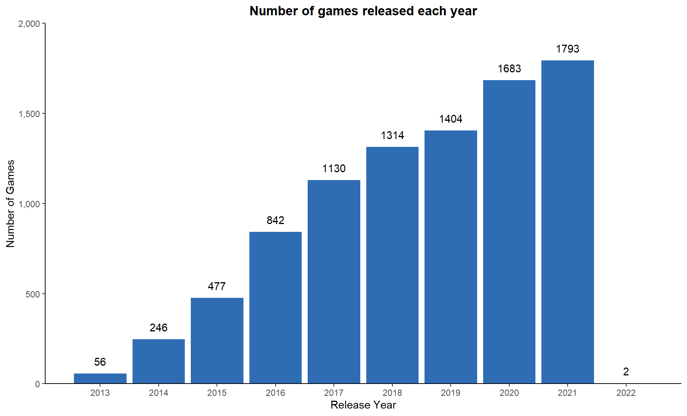
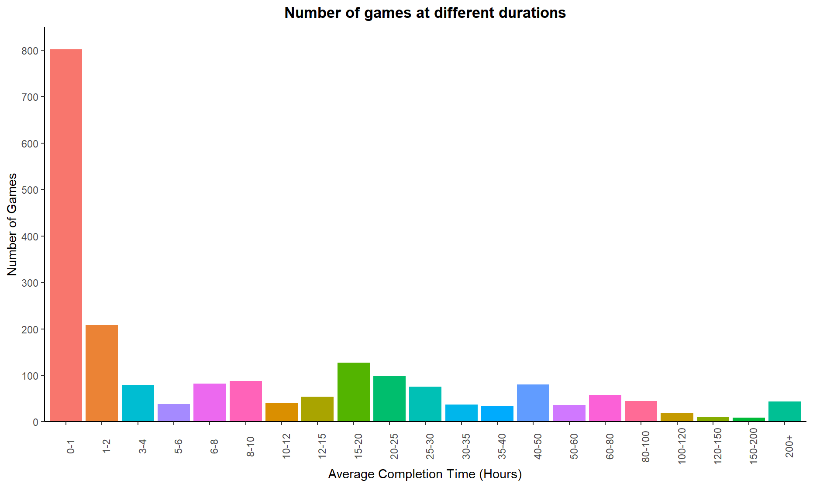
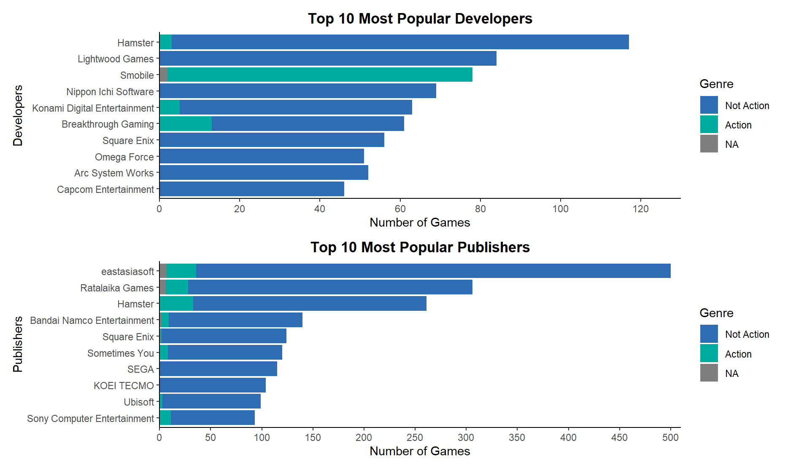

## Introduction 

The Playstation 4 (PS4) is a home video game console that was developed by Sony Computer Entertainment. It is the successor to the PS3 and launched on November 15th, 2013 in North America. The following dataset contains a wide-range of information such as the names of the games along with their publishers and developers. 

## Objective 

I chose this dataset because the PS4, which has been available to the public for almost a decade, has led to the production of many award-winning games such as “God of War (2018)”, “Spider-Man (2018)” and “Horizon Zero Dawn (2017)”. 

The goal of this project is to analyze the "All Playstation 4 Games" dataset and answer the following three questions: 

1. Which year were the most games released?
2. What is the relationship between average completion time and games? 
3. Who are the most popular publishers and developers & how many action games did they produce?

## Citation

-   Shivam, B. (2022). All Playstation 4 Games, Version 1. Retrieved August 21, 2022 from https://www.kaggle.com/datasets/shivamb/all-playstation-4-games.

## Graphic 1

## Graphic 2 

## Graphic 3 

## What do the visualizations communicate?

-   These graphics help to communicate the dataset, such as the amount of games that were released each year, their average completion time, and the top ten most popular developers and publishers.\
-   However, some graphics do not translate the data well, which can bring limitations to the story-telling. Therefore, the bar charts were used because they emphasized the dramatic differences between different variables (e.g. developers, publishers, games).